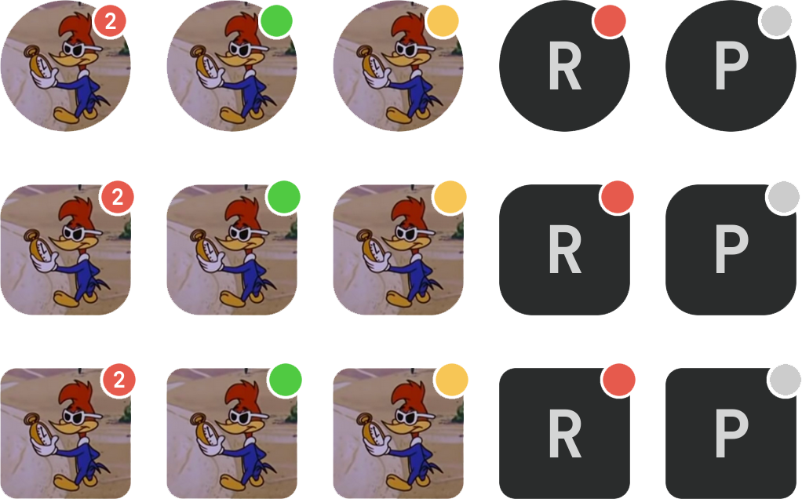

<div align="center">

# Rectar
A React lib to generate easily customizable avatars


   
</div>

## Installation

### Using Yarn

```
yarn add reactar
```

### Using Npm

```
npm i reactar
```
## Usage

### Importing

You can import reactar component as default and use all modes 

```ts
import Reactar from 'reactar'
```
or import separately each one

```ts
import { ReactarNotification, ReactarStatus, ReactarDefault } from 'reactar'
```

### Examples



### Usage Examples

```ts
<Reactar badgeType="status" name="pmqueiroz" status="online" />

<Reactar badgeType="notification" name="pmqueiroz" count={3} />
```
## Parameters

| Parameter             | Required               | Default         | Type                                                   |
| --------------------- | ---------------------- | --------------- | ------------------------------------------------------ |
| badgeType             | yes                    | "none"          | "none", "notification", "status"                       |
| name                  | yes                    | "Reactar"       | string                                                 |
| badgePosition         | no                     | "top-right"     | "top-left", "top-right", "bottom-right", "bottom-left" |
| badgeColor            | no                     | [BadgeColorsDefaults](#BadgeColorsDefaults) | [BadgeColorsDefaults](#BadgeColorsDefaults)                                 |
| radii                 | no                     | "circle"        | "circle", "square", "rounded"                          |
| url                   | no                     | undefined       | string                                                 |
| backgroundColor       | no                     | "#2A2C2C"       | CSSProperties['color']                                 |
| size                  | no                     | 48              | px                                                     |
| status                | if type "status"       | online          | "online", "busy", "offline", "idle"                    |
| count                 | if type "notification" | undefined       | number                                                 |
| notificationTextColor | if type "notification" | "#FFFFFF"       | CSSProperties['color']                                 |
                                                   

> Obs.: Size will be converted to rem in base16

#### BadgeColorsDefaults

```ts
{
   notification: '#E65A4D',
   busy: '#E65A4D',
   idle: '#F7C656',
   offline: '#CCCCCC',
   online: '#50CA42'
}
```
## License

[MIT](https://github.com/pmqueiroz/reactar/blob/master/LICENSE)

